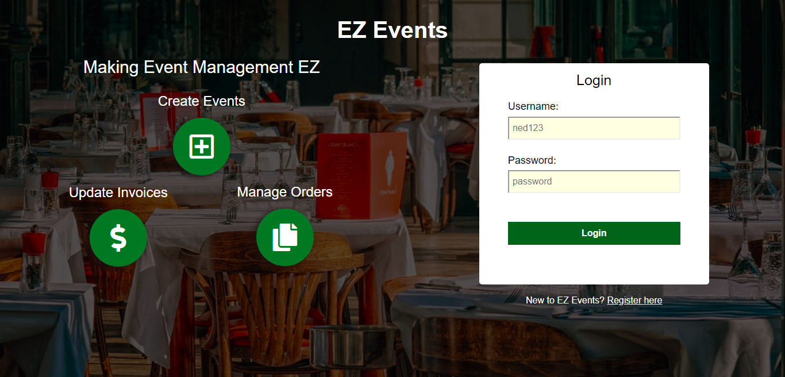
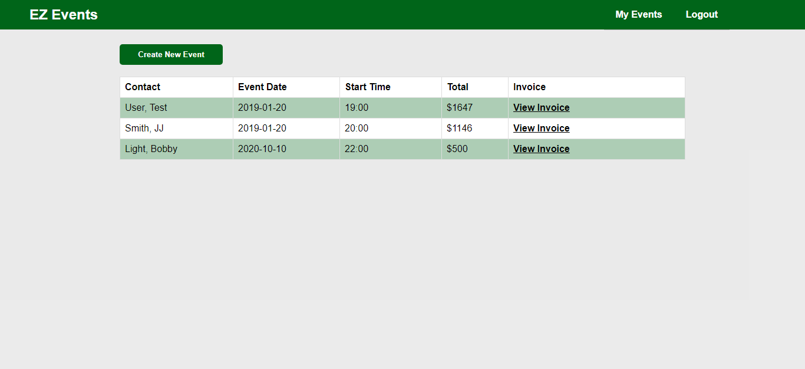
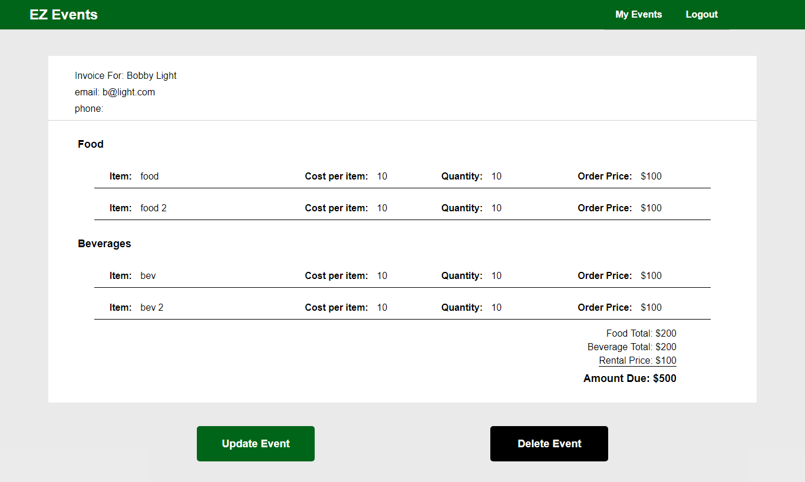

EZ Events
=============
A simple app for event management, tracking, and invoicing. 

Live Demo
-----------
https://e-z-events.herokuapp.com/

username: demo
password: password

Usage
-----------
1. Login using demo credintials or click 'register here' to create new user
2. Click 'Create New Event' button to display form
3. Enter required credentials in 'Create New Event' form    
4. If you wish to add more Food or Beverage inputs click the corresponding 'Add' button
5. When finished click 'Create' to submit or 'Cancel' to disgard.
6. View your event in the table on your home screen
7. Click 'View Invoice' to view invoice report
8. Click 'Delete Event' to delete. WARNING if clicked it will be permanently deleted 
9. Click 'Update Event' to display the Update Form
10. Update need values and click 'Update Event' again to update

Screenshots
-------------
### Login

### Home Screen

### View Invoices

Technologies 
------------
* HTML
* CSS
* JavaScript
* JQuery
* NodeJS
* Express
* JSON Web Token
* Mongoose
* MongoDB
* Travis-CI
* Heroku

Coming Updates
---------------
* Filter and search table
* Page for weekly, yearly, and month incoming reporting
* Dedicated table for completed and paid events/invoices